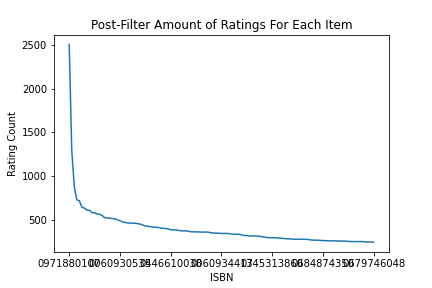

# Book Recommender
Dataset: [Book-Crosing Dataset](http://www2.informatik.uni-freiburg.de/~cziegler/BX/)

## Purpose
The purpose of this project was to experiment building a recommendation enginer with a kth-Nearest-Neighbor approach. This can be used in a variety of applications other than a book recommendation such as movie recommendation, music recommendation, shopping recommendation, etc. Another purpose of doing this project was to familiarize myself with different ways to visualize data using Python. 

## Data Analysis
The first thing I did when analyzing the data is look at the distibution of ratings. 

Looking at this we can see that there is a heavy skew towards ratings with a 0. This get's worked on later. 

After looking at the rating distibution I decided to create a distribution for user's age. 

This shows that most ratings are from people around the age of 20. I decided that this data wouldn't be helpful to include in the modal when considering books, but if this was a movie or music reommendation engine I would've considered including them. 

Knowing that the majority of ratings were 0, I considered looking at the average rating for every book. 

And as expected you can see that most books had an average rating between 0 and 1. 

Looking at how most of the ratings are 0, I began to think of ways to trim down the dataset since there was probably no need for a good chunk of it. Looking at a graph of how many ratings each item has you can see that most items have less than 250 ratings. 

Seeing this I decided to go ahead and filter out all the books that had less than 250 ratings since they wouldn't lend much data to the model, and that resulted in a graph that looked like this. 

At this point I decieded to move on to building the model. I definitly could've spent more time looking for more features in the data and tuning the data, but decided to move on to the model building phase. (Maybe I'll return to this project and tune the data some more)

## Model Building
When building the model I decieded on using a cosine metric and left the algorithim as auto. After fitting the model I used np.random.choice to randomly choose items and find the recommendations.

The book that was used to find recommendations:

Recommendations:

