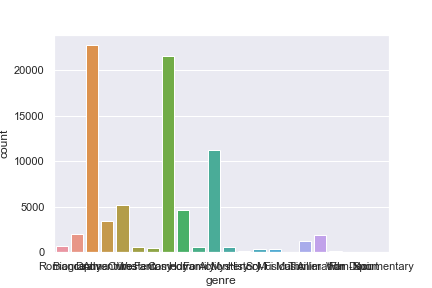
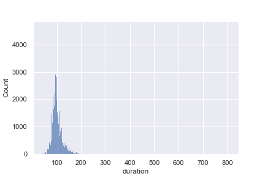
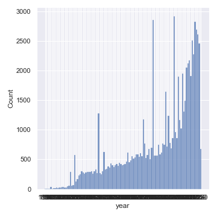
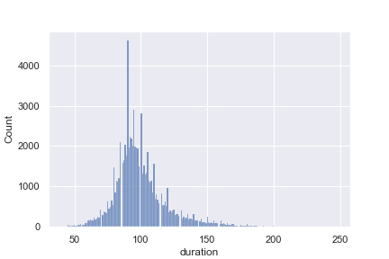
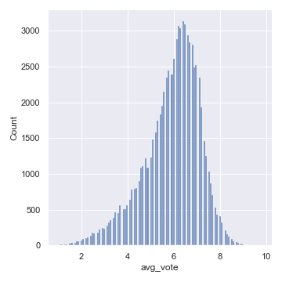
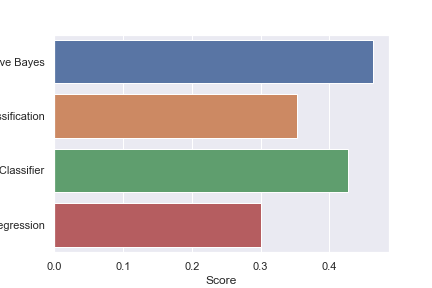

# Movie Genre Guesser
__Dataset:__ [Kaggle](https://www.kaggle.com/stefanoleone992/imdb-extensive-dataset)

**Check out the [Jupyter Notebook](./MovieGenre.ipynb) to see better versions of the charts and code!**

## The Idea
The ideas behind this project was to experiment with using different amounts of data to try and be able to classify movies
by genre. I also took this opportunity to refresh on some ML algorithms I was already slightly familiar with and learn some 
new ones too! I decided to use `sklearn` for this project just because I felt like I didn't have a lot of experience with it
and wanted to get my feet wet with it.

## Exploratory Data Analysis

## Analysis

 
As you can see from the above chart, Categorical Naive Bayes was able to achieve the best results. This was what I expected after
trying to work with the data to help the Logistic Regression algorithm converge.

Overall this has been a really fun and interesting project to work on. It was fun getting to read and experiment with different algorithms
along the way.