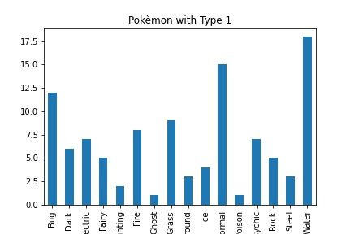
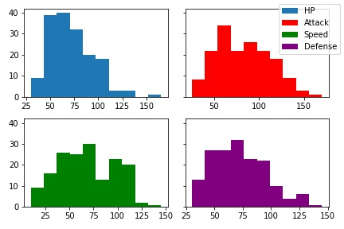
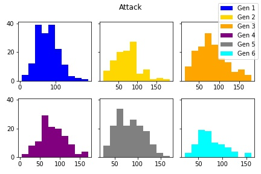
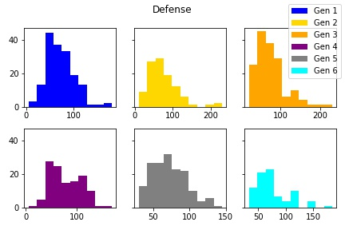
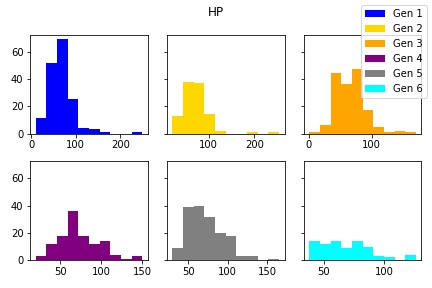

# Pokémon Statistical Analysis
___Dataset:___ https://www.kaggle.com/abcsds/pokemon

**Check out the [Jupyter Notebook](./notebook.ipynb) to see better versions of the charts and code!**

## The Idea
The purpose of this project is to experiment with some Exploratory data analysis with some Pokèmon statistics.
In this notebook I will frequently use the abbreviation "gen" when referring to "generation".

## Exploratory Charts Per Generation

  
Generation 1

  
  

  
Generation 2

  
  

  
Generation 3

  
  

  
Generation 4

  
  

  
Generation 5

  
  

  
Generation 6

  
  

From the general shape of these charts we can start to see that between generations there do seem to be some general patterns.

## Exploratory Charts Cross Generation

  
Attack Comparison

  
  

  
Defense Comparison

  
  

  
HP Comparison

  
  

  
Speed Comparison

  
  

When comparing the histogram charts of different Pokèmon stats you can notice a strange behavior that Gens 1, 3, and 5 have
similar distributions and 2, 4, and 6 have similar distributions. This is interesting because it also looks like Gen 1, 3, and
5 have a higher top bin than on most stats. This would mean that more of the Pokèmon have lower stats, but the max
stats for the generation are higher.

For Gens 2, 4, and 6 we can notice that the distribution is more even throughout the stats but the max stats for these gens
are lower than the other generations.

Now I want to compare the mean stats for each generation.

Also, from the above charts were I compared the mean of each stat per generation we can see that there isn't as much
of a pattern as we saw with the histograms. This shows that even though the histograms are off that there are
just a few outliers in each generation but the majority of Pokèmon have similar stats across generations.

This next chart is going to look a little crazy but stick with me.

I warned you this chart was going to look a little crazy, but we can notice some interesting things from this chart.
We notice the same correlation pattern between Gens 1, 3, and 5 having, in some cases significantly, more Pokèmon
than the other generations. Knowing this, we can revisit some of the earlier charts we generated with a little more
context.

## Conclusion

In this project I looked at how to visualize different data from the Pokémon stats dataset. I really wanted
to focus on gaining some experience with the matplotlib library and working with panda's DataFrames.

To see some of my experiments with Classification and Clustering using the sklearn library checkout the JupyterNotebook!
